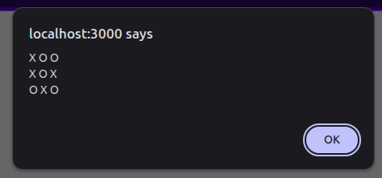

# Tres en raya con alerts

Haz el juego del tres en raya para dos jugadores.

En un alert del navegador dibujarás un tablero cuadrado de 3x3. Cada jugador, por turnos, introducirá el número de una casilla para poner una X o un O, hasta que uno de los dos ponga 3 fichas iguales en línea. 

**Nota**: Este ejercicio tendrás que ejecutarlo en un navegador para permitir que el usuario introduzca datos.

## Paso 1: Crear y mostrar el tablero

Crea un array bidimensional de 3x3 y pon dentro, manualmente una X o un O en cada posición. Después, muestra un alert que tenga una forma similar a esto:

    
Pista 1: Como hacer arrays bidimensionales

    const array2D: number[][] = [
        ['1', '2', '3'],
        ['4', '5', '6'],
        ['7', '8', '9'],
    ]

    
Pista 2: Recorrer un array bidimensional

    for (let fila of array2D) {
        for (let celda of fila) {
            console.log(celda)
        }
    }

    
Pista 3: Saltos de línea en un alert

    const texto = "Para hacer un salto de línea.\n. Tienes que utilizar una barra seguida de una n.\n Eso es un caracter especial que JS interpreta como un salto de línea\n. ¿Entiendes?"

    alert(texto)

    
Pista 4: Paso completo

    const tablero: string[][] = [
        ['X', 'O', 'O'],
        ['X', 'O', 'X'],
        ['O', 'X', 'O'],
    ]

    let texto = "";

    for (let fila of tablero) {
        for (let celda of fila) {
            texto += celda + " ";
        }

        texto += "\n";
    }

    alert(texto);

## Paso 2: Pedir input al usuario

Crea un array bidimensional con un valor que represente una posición vacía, por ejemplo, ponle '_'. Después, pide al usuario que te introduzca un número indicando la fila y otro número indicando la columna. 

Tu vas a poner una X en la posición que el usuario te haya indicado. Entonces volverás a preguntar, y esta vez pondrás un O. Así 
sucesivamente. Alternando X y O.

Cuando lo hayas puesto, volverás a mostrar el tablero.

    
Pista 1: Modificar una posición del array bidimensional

    const tablero: string[][] = [
        ['_', '_', '_'],
        ['_', '_', '_'],
        ['_', '_', '_'],
    ]

    tablero[1][2] = 'O' // Modifica la fila 1 columna 2
    tablero[2][0] = 'X' // Modifica la fila 2 columna 0

    let texto = ""
    for (let fila of tablero) {
        for (let celda of fila) {
            texto += celda + "  ";
        }

        texto += "\n";
    }

    alert(texto);

    
Pista 2: Cambiar X por O y viceversa

    let valor = 'X'

    valor = valor === 'X' ? 'O' : 'X'

    
Pista 3: Paso completo

    const tablero: string[][] = [
        ['_', '_', '_'],
        ['_', '_', '_'],
        ['_', '_', '_'],
    ]

    let valor: string = "X"
    let columnaElegida: number = 0
    let filaElegida: number = 0
    let jugando: boolean = true

    while (jugando){
        let texto = ""
        for (let fila of tablero) {
            for (let celda of fila) {
                texto += celda + "  ";
            }

            texto += "\n";
        }

        alert(texto);

        alert(`Turno del jugador ${valor}`)

        filaElegida = Number(prompt("Introduce la fila"))
        columnaElegida = Number(prompt("Introduce la columna"))

        tablero[filaElegida][columnaElegida] = valor

        valor = valor === 'X' ? 'O' : 'X'
    }

## Paso 3: Validaciones

Pon una validación en el juego, para que cada vez que el usuario ponga una fila o columna que no existen, salga un error y le vuelva a pedir los datos.

Pon otra validación para que si la casilla que quiere modificar no esta vacía, que vuelva a pedir fila y columna.

    
Pista 1: Saltar a la siguiente iteración del bucle

    while (true){
        let respuesta = prompt("Escribe algo (escribe 'continue' para pasar a la siguiente iteración)")

        if (respuesta === "continue"){
            continue
        }

        alert(`Has escrito: ${respuesta}, por lo tanto, estas viendo este mensaje`)
    }

    
Pista 2: Validar que el número introducido este en el rango

    let numero: number = 0

    while (true){
        numero = Number(prompt("Introduce un numero entre 0 y 2"))
        if (numero < 0 || numero > 2) {
            alert("No has introducido un número válido, inténtalo de nuevo")
            continue
        }

        alert(`Has introducido el número ${numero}`)
    }

    
Pista 3: Validar que se pueda jugar en la casilla indicada

    const tablero: string[][] = [
        ['X', '_', '_'],
        ['O', '_', 'X'],
        ['_', 'O', '_'],
    ]

    let columnaElegida: number = 0
    let filaElegida: number = 0

    while (true){
        filaElegida = Number(prompt("Introduce la fila"))
        columnaElegida = Number(prompt("Introduce la columna"))

        if (tablero[filaElegida][columnaElegida] !== '_'){
            alert(`Posición ocupada, inténtalo de nuevo`)
            continue
        }

        alert(`Has colocado en la fila ${filaElegida} y columna ${columnaElegida}`)
    }
    

    
Pista 4: Paso completo

    const tablero: string[][] = [
        ['_', '_', '_'],
        ['_', '_', '_'],
        ['_', '_', '_'],
    ]

    let valor: string = "X"
    let columnaElegida: number = 0
    let filaElegida: number = 0
    let jugando: boolean = true

    while (jugando){
        let texto = ""
        for (let fila of tablero) {
            for (let celda of fila) {
                texto += celda + "  ";
            }

            texto += "\n";
        }

        alert(texto);

        alert(`Turno del jugador ${valor}`)

        filaElegida = Number(prompt("Introduce la fila"))
        if (filaElegida < 0 || filaElegida > 2) {
            alert("Fila no válida, inténtalo de nuevo")
            continue
        }

        columnaElegida = Number(prompt("Introduce la columna"))
        if (columnaElegida < 0 || columnaElegida > 2) {
            alert("Columna no válida, inténtalo de nuevo")
            continue
        }

        if (tablero[filaElegida][columnaElegida] !== '_') {
            alert("La celda ya está ocupada, inténtalo de nuevo")
            continue
        }

        tablero[filaElegida][columnaElegida] = valor

        valor = valor === 'X' ? 'O' : 'X'
    }

## Paso 4: Tablero completo

Cada vez que un jugador juegue, comprueba que el tablero siga teniendo casillas vacias. Si ya no quedan casillas vacías, acaba el juego.

    
Pista 1: Comprobar si quedan casillas vacías

    const tablero: string[][] = [
        ['_', '_', '_'],
        ['_', '_', '_'],
        ['_', '_', '_'],
    ]

    let jugando = true
    let columna: number = 0
    let fila: number = 0

    while (jugando){
        fila = Number(prompt("Introduce la fila"))
        columna = Number(prompt("Introduce la columna"))
        tablero[fila][columna] = 'X'

        jugando = false // Partimos de que el juego ha acabado
        for (let fila of tablero) {
            for (let celda of fila) {
                if (celda === '_'){
                    jugando = true // Si encontramos una casilla vacía, el juego no ha acabado
                }
            }
        }
    }

    
Pista 2: Paso completo

    
    const tablero: string[][] = [
        ['_', '_', '_'],
        ['_', '_', '_'],
        ['_', '_', '_'],
    ]

    let valor: string = "X"
    let columnaElegida: number = 0
    let filaElegida: number = 0
    let jugando: boolean = true

    while (jugando){
        let texto = ""
        for (let fila of tablero) {
            for (let celda of fila) {
                texto += celda + "  ";
            }

            texto += "\n";
        }

        alert(texto);

        alert(`Turno del jugador ${valor}`)

        filaElegida = Number(prompt("Introduce la fila"))
        if (filaElegida < 0 || filaElegida > 2) {
            alert("Fila no válida, inténtalo de nuevo")
            continue
        }

        columnaElegida = Number(prompt("Introduce la columna"))
        if (columnaElegida < 0 || columnaElegida > 2) {
            alert("Columna no válida, inténtalo de nuevo")
            continue
        }

        if (tablero[filaElegida][columnaElegida] !== '_') {
            alert("La celda ya está ocupada, inténtalo de nuevo")
            continue
        }

        tablero[filaElegida][columnaElegida] = valor

        valor = valor === 'X' ? 'O' : 'X'

        jugando = false
        for (let fila of tablero) {
            for (let celda of fila) {
                if (celda === '_'){
                    jugando = true
                }
            }
        }
    }

## Paso 5: Comprobar si un jugador ha ganado

Cada vez que un jugador haga su jugada, comprueba si ha ganado. Para eso, tienes que mirar las 3 filas, las 3 columnas y las dos diagonales. Y comprobar que las 3 tengan el mismo valor.

    
Pista 1: Comprobar las diagonales

    const tablero: string[][] = [
        ['X', 'O', 'X'],
        ['O', 'X', 'X'],
        ['X', 'O', 'O'],
    ]

    if (
        tablero[0][0] === tablero[1][1] && 
        tablero[1][1] === tablero[2][2] &&
        tablero[1][1] !== '_'
    ) {
            
        alert(`Ha ganado el jugador ${tablero[1][1]}`)
    } else if (
        tablero[0][2] === tablero[1][1] && 
        tablero[1][1] === tablero[2][0] &&
        tablero[1][1] !== '_'
    ) {
        alert(`Ha ganado el jugador ${tablero[1][1]}`)
    }

    
Pista 2: Comprobar las filas

    const tablero: string[][] = [
        ['O', 'X', 'O'],
        ['O', 'O', 'X'],
        ['X', 'X', 'X'],
    ]

    let ganador: string = ''
    for (let fila = 0; fila < 3; fila++) {
        if (
            tablero[fila][0] === tablero[fila][1] && // Columnas 0 y 1
            tablero[fila][1] === tablero[fila][2] && // Columnas 1 y 2
            tablero[fila][0] !== '_'
        ) {
            alert(`Ha ganado el jugador ${tablero[fila][0]}`)
        }
    }

    
Pista 3: Comprobar las columnas

    const tablero: string[][] = [
        ['O', 'O', 'X'],
        ['X', 'O', 'X'],
        ['O', 'X', 'X'],
    ]

    let ganador: string = ''

    for (let columna = 0; columna < 3; columna++) {
        if (
            tablero[0][columna] === tablero[1][columna] && // Filas 0 y 1
            tablero[1][columna] === tablero[2][columna] && // Filas 1 y 2
            tablero[0][columna] !== '_'
        ) {
            alert(`Ha ganado el jugador ${tablero[0][columna]}`)
        }
    }

    
Pista 4: Comprobar todo de forma eficiente

    const tablero: string[][] = [
        ['X', 'O', 'X'],
        ['O', 'X', 'X'],
        ['X', 'O', 'O'],
    ]

    let ganador: string = ''

    for (let i = 0; i < 3; i++) {
        if (tablero[i][0] !== '_' && tablero[i][0] === tablero[i][1] && tablero[i][1] === tablero[i][2]) {
            ganador = tablero[i][0]
            break
        }

        if (tablero[0][i] !== '_' && tablero[0][i] === tablero[1][i] && tablero[1][i] === tablero[2][i]) {
            ganador = tablero[0][i]
            break
        }
    }

    if (tablero[1][1] !== '_') {
        if ((tablero[0][0] === tablero[1][1] && tablero[1][1] === tablero[2][2]) ||
            (tablero[0][2] === tablero[1][1] && tablero[1][1] === tablero[2][0])) {
            ganador = tablero[1][1]
        }
    }

    if (ganador !== '') {
        console.log(`El ganador es: ${ganador}`)
    }

    
Pista 5: Paso completo

    
    const tablero: string[][] = [
        ['_', '_', '_'],
        ['_', '_', '_'],
        ['_', '_', '_'],
    ]

    let valor: string = "X"
    let columnaElegida: number = 0
    let filaElegida: number = 0
    let jugando: boolean = true
    let ganador: string = ''

    while (jugando){
        let texto = ""
        for (let fila of tablero) {
            for (let celda of fila) {
                texto += celda + "  ";
            }

            texto += "\n";
        }

        alert(texto);

        alert(`Turno del jugador ${valor}`)

        filaElegida = Number(prompt("Introduce la fila"))
        if (filaElegida < 0 || filaElegida > 2) {
            alert("Fila no válida, inténtalo de nuevo")
            continue
        }

        columnaElegida = Number(prompt("Introduce la columna"))
        if (columnaElegida < 0 || columnaElegida > 2) {
            alert("Columna no válida, inténtalo de nuevo")
            continue
        }

        if (tablero[filaElegida][columnaElegida] !== '_') {
            alert("La celda ya está ocupada, inténtalo de nuevo")
            continue
        }

        tablero[filaElegida][columnaElegida] = valor

        valor = valor === 'X' ? 'O' : 'X'

        for (let i = 0; i < 3; i++) {
            if (tablero[i][0] !== '_' && tablero[i][0] === tablero[i][1] && tablero[i][1] === tablero[i][2]) {
                ganador = tablero[i][0]
                break
            }

            if (tablero[0][i] !== '_' && tablero[0][i] === tablero[1][i] && tablero[1][i] === tablero[2][i]) {
                ganador = tablero[0][i]
                break
            }
        }

        if (tablero[1][1] !== '_') {
            if ((tablero[0][0] === tablero[1][1] && tablero[1][1] === tablero[2][2]) ||
                (tablero[0][2] === tablero[1][1] && tablero[1][1] === tablero[2][0])) {
                ganador = tablero[1][1]
            }
        }

        jugando = false
        if (ganador === '') {
            for (let fila of tablero) {
                for (let celda of fila) {
                    if (celda === '_'){
                        jugando = true
                    }
                }
            }
        }
    }

    if (ganador !== '') {
        alert(`¡El ganador es el jugador ${ganador}!`)
    } else {
        alert("¡Empate!")
    }

## Paso 6: Utiliza funciones

Una vez que el código funciona perfecto. Pon todo en funciones para que quede más claro.